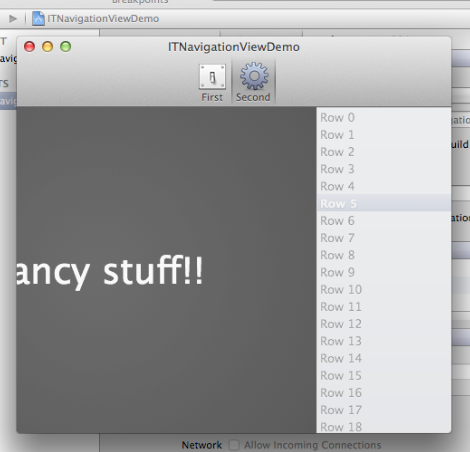

ITNavigationView
================

A iOS like view driven by Core Animation, that can replace it's subview with a sleek animation

Screenshot
==========

Usage
-----

### Copy files

Copy the following files:

* `ITNavigationView.h`
* `ITNavigationView.m`

Make sure to copy them to the project, and to add them to the target.
Also, make sure to include the QuartzCore framework.

### Use in a project

Drag a custom view onto your window.
Set it's custom class to `ITNavigationView`.

Now you can connect an outlet to it, and use the following methods and properties:

    @property (nonatomic, strong) NSViewController *currentViewController;
    
    - (void)setCurrentViewController:(NSViewController *)currentViewController
                  withAnimationStyle:(ITNavigationViewAnimationStyle)animationStyle;
                  
    - (void)setCurrentViewController:(NSViewController *)currentViewController
                       withAnimation:(BOOL)animationFlag;
                       
    @property ITNavigationViewAnimationStyle animationStyle;
    @property (nonatomic) NSTimeInterval animationDuration;
    @property (nonatomic, strong) CAMediaTimingFunction *timingFunction;
    @property (nonatomic) BOOL fadeAnimation;

    
### License

    Copyright (c) 2013 - 2014, Ilija Tovilo
    All rights reserved.
    
    Redistribution and use in source and binary forms, with or without
    modification, are permitted provided that the following conditions are met:
        * Redistributions of source code must retain the above copyright
          notice, this list of conditions and the following disclaimer.
        * Redistributions in binary form must reproduce the above copyright
          notice, this list of conditions and the following disclaimer in the
          documentation and/or other materials provided with the distribution.
        * Neither the name of the organization nor the
          names of its contributors may be used to endorse or promote products
          derived from this software without specific prior written permission.
    
    THIS SOFTWARE IS PROVIDED BY THE COPYRIGHT HOLDERS AND CONTRIBUTORS "AS IS" AND
    ANY EXPRESS OR IMPLIED WARRANTIES, INCLUDING, BUT NOT LIMITED TO, THE IMPLIED
    WARRANTIES OF MERCHANTABILITY AND FITNESS FOR A PARTICULAR PURPOSE ARE
    DISCLAIMED. IN NO EVENT SHALL ILIJA TOVILO BE LIABLE FOR ANY
    DIRECT, INDIRECT, INCIDENTAL, SPECIAL, EXEMPLARY, OR CONSEQUENTIAL DAMAGES
    (INCLUDING, BUT NOT LIMITED TO, PROCUREMENT OF SUBSTITUTE GOODS OR SERVICES;
    LOSS OF USE, DATA, OR PROFITS; OR BUSINESS INTERRUPTION) HOWEVER CAUSED AND
    ON ANY THEORY OF LIABILITY, WHETHER IN CONTRACT, STRICT LIABILITY, OR TORT
    (INCLUDING NEGLIGENCE OR OTHERWISE) ARISING IN ANY WAY OUT OF THE USE OF THIS
    SOFTWARE, EVEN IF ADVISED OF THE POSSIBILITY OF SUCH DAMAGE.

